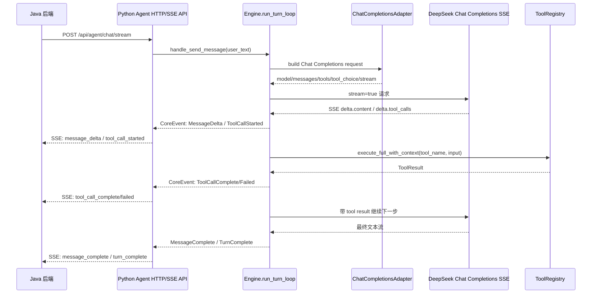

# Agent 输入到输出流程与 Java SSE 对接架构说明

本文面向准备把 Python agent 与 Java 后端对接的实现方。重点说明：用户输入如何进入 agent、Chat Completions 请求如何构造、DeepSeek SSE 如何解析和拼接、工具调用结果如何进入下一轮 loop，以及 Python 端应如何把拼接后的增量事件异步返回给 Java。

## 1. 当前模块定位

当前 agent MVP 位于：

- `python_demo_test/agent_input_framework_mvp/engine/core.py`
- `python_demo_test/agent_input_framework_mvp/engine/sse_client.py`
- `python_demo_test/agent_input_framework_mvp/view/chat_completions_adapter.py`
- `python_demo_test/agent_input_framework_mvp/view/tooling.py`
- `python_demo_test/agent_input_framework_mvp/agent_http_server.py`

当前已有能力：

- 单个 session 内保留历史消息。
- 单个用户 turn 内支持多步 loop。
- 支持 OpenAI-compatible Chat Completions 请求格式。
- 支持 DeepSeek SSE 流式响应。
- 支持 function tool call 解析、工具执行、tool result 回填、继续下一步推理。
- 支持最大步数停止条件 `MaxStepsStopController`。
- 工具调用不设独立次数上限；模型依据系统终止规则主动结束并输出最终回答。
- 到达 `maxSteps` 的最后一个可用 step 时，Python 会移除 tools 并注入强制总结提示，要求模型基于已有信息输出最终答案。
- 已修复多工具调用时按 `tool_calls[].index` 拼接参数的问题。

当前还没有完整实现的部分：

- `agent_http_server.py` 当前主要是同步 JSON 返回，不是面向 Java 的生产级 SSE 流式接口。
- 工具审批、权限、风控字段已经预留，但当前 demo 不启用。
- 工具执行当前是顺序执行，不是真并行执行。
- memory、planner、loop view 的完整工程化仍在后续阶段。

## 2. 总体流程



核心是两层流：

1. Provider SSE：DeepSeek 返回的原始 Chat Completions SSE。
2. Application SSE：Python 端把 Engine 内部事件转换成 Java 更容易消费的业务事件。

Java 后端不建议直接解析 DeepSeek 原始 SSE。Java 应该只接收 Python 转换后的 Application SSE。

## 3. 输入侧协议

建议 Java 调 Python 时使用一个明确的请求体：

```json
{
  "conversationId": "conv_123",
  "userId": "user_001",
  "message": "我是一个科技区视频创作者，帮我找最近适合做选题的热点",
  "metadata": {
    "source": "web",
    "clientTraceId": "trace_abc",
    "currentDate": "2026-07-11"
  },
  "settings": {
    "maxSteps": 12,
    "model": "deepseek-v4-flash"
  }
}
```

字段说明：

| 字段 | 必填 | 说明 |
| --- | --- | --- |
| `conversationId` | 是 | Java 侧会话 ID。Python 用它复用或创建 `Session`。 |
| `userId` | 否 | 业务用户 ID，只作为元数据透传。 |
| `message` | 是 | 用户原始输入。 |
| `metadata` | 否 | 业务上下文、客户端追踪 ID、当前日期等。 |
| `settings` | 否 | 本轮运行参数，如最大 loop 步数、模型名。`maxSteps` 默认且最大均为 12。 |

Python 接收后进入：

```text
Agent API
-> get_agent(conversationId)
-> Engine.handle_send_message(message)
-> Session.messages.append_user_message(...)
-> Engine.run_turn_loop(...)
```

## 4. 工程 View 到 Chat Completions 的转换

转换逻辑在 `view/chat_completions_adapter.py`。

工程侧对象：

```text
PromptRequest
  - model
  - system: SystemPrompt
  - messages: MessageHistory
  - tools: ToolCatalog
  - tool_choice
  - stream
```

转换成 Chat Completions：

```json
{
  "model": "deepseek-v4-flash",
  "messages": [
    {
      "role": "system",
      "content": "..."
    },
    {
      "role": "user",
      "content": "用户输入\n\nTurn Metadata:\n\n{...}"
    },
    {
      "role": "assistant",
      "content": null,
      "tool_calls": [
        {
          "id": "call_xxx",
          "type": "function",
          "function": {
            "name": "web_search",
            "arguments": "{\"query\":\"...\"}"
          }
        }
      ]
    },
    {
      "role": "tool",
      "tool_call_id": "call_xxx",
      "content": "{...工具结果...}"
    }
  ],
  "tools": [
    {
      "type": "function",
      "function": {
        "name": "web_search",
        "description": "...",
        "parameters": {
          "type": "object",
          "properties": {}
        },
        "strict": false
      }
    }
  ],
  "tool_choice": "auto",
  "stream": true
}
```

注意：

- `tools` 是顶层字段，不要塞进 `messages[].content`。
- assistant 工具调用必须使用 `tool_calls`。
- 工具结果必须使用 `role="tool"`，并带 `tool_call_id`。
- 当 `tool_choice=none` 时，当前实现会不发送 `tools` 字段，避免模型把工具调用以 DSML 文本形式输出到最终回复。

## 5. DeepSeek SSE 解析与拼接

DeepSeek 原始 SSE 每行形如：

```text
data: {"choices":[{"delta":{"content":"你好"}}]}
data: {"choices":[{"delta":{"tool_calls":[...]}}]}
data: [DONE]
```

Python 侧解析在 `engine/sse_client.py`：

```text
ChatCompletionsSseClient.create_message_stream
-> _iter_sse_payloads
-> _stream_response_to_events
-> yield StreamEvent
```

### 5.1 文本增量

原始片段：

```json
{
  "choices": [
    {
      "delta": {
        "content": "这是"
      }
    }
  ]
}
```

转换成内部事件：

```json
{
  "event_type": "ContentBlockDelta",
  "block_type": "text",
  "delta": "这是"
}
```

Engine 收到后追加到 `assistant_text_parts`，并对外产生：

```json
{
  "event_type": "MessageDelta",
  "payload": {
    "delta": "这是"
  }
}
```

### 5.2 工具调用增量

原始片段可能被拆得很碎：

```json
{
  "choices": [
    {
      "delta": {
        "tool_calls": [
          {
            "index": 0,
            "id": "call_abc",
            "type": "function",
            "function": {
              "name": "fetch_url",
              "arguments": "{\"url\":\"https"
            }
          }
        ]
      }
    }
  ]
}
```

后续可能继续：

```json
{
  "choices": [
    {
      "delta": {
        "tool_calls": [
          {
            "index": 0,
            "function": {
              "arguments": "://example.com\"}"
            }
          }
        ]
      }
    }
  ]
}
```

解析后内部事件必须携带 `tool_call_index`：

```json
{
  "event_type": "ContentBlockDelta",
  "block_type": "tool_use",
  "tool_call_index": 0,
  "delta": "{\"url\":\"https"
}
```

Engine 使用：

```text
tool_states_by_index[index].input_buffer += delta
```

这样才能支持一轮中多个工具调用：

```json
{
  "tool_calls": [
    {
      "index": 0,
      "function": {
        "name": "fetch_url",
        "arguments": "{\"url\":\"https://a.com\"}"
      }
    },
    {
      "index": 1,
      "function": {
        "name": "fetch_url",
        "arguments": "{\"url\":\"https://b.com\"}"
      }
    }
  ]
}
```

重要约束：

- 不要只用一个 `active_tool_state` 拼接所有工具参数。
- 必须按 `tool_calls[].index` 分别维护输入缓冲区。
- 如果缺少 `index`，才降级使用当前 active tool。
- `ContentBlockStop` 时再对对应 `ToolUseState.input_buffer` 做 `json.loads`。

这是之前 `fetch_url {}` 问题的根因：DeepSeek 原始 SSE 中多个 `fetch_url` 都带完整 URL，但 Engine 旧实现没有把 `index` 贯穿到拼接层，导致前几个工具参数没有拼到对应状态里，最终变成 `{}`。

## 6. Engine loop 状态机

主循环在 `Engine.run_turn_loop`：

```text
while not stop_controller.should_stop(...):
    turn.next_step()
    request = MessageRequestBuilder(...).build()
    stream = llm_client.create_message_stream(request)

    for event in stream:
        if text delta:
            收集 assistant 文本
        if tool_use delta:
            按 index 收集工具参数
        if error:
            产生 Error 事件并结束

    if tool_states:
        写入 assistant tool_calls 消息
        顺序执行工具
        写入 tool result 消息
        continue

    写入最终 assistant 文本
    return
```

一个典型 turn 的 session message 会变成：

```text
user
assistant(tool_calls=[web_search])
tool(result for web_search)
assistant(tool_calls=[fetch_url])
tool(result for fetch_url)
assistant(final text)
```

## 7. Python 对 Java 的 Application SSE 设计

建议新增接口：

```text
POST /api/agent/chat/stream
Content-Type: application/json
Accept: text/event-stream
```

Java 收到的 SSE 不直接暴露 DeepSeek 原始 chunk，而使用统一 envelope：

```text
event: message_delta
data: {"conversationId":"conv_123","turnId":"turn_x","step":1,"seq":12,"delta":"你好"}

event: tool_call_started
data: {"conversationId":"conv_123","turnId":"turn_x","step":1,"toolUseId":"call_x","toolName":"web_search","inputPreview":null}

event: tool_call_complete
data: {"conversationId":"conv_123","turnId":"turn_x","step":1,"toolUseId":"call_x","toolName":"web_search","isError":false,"resultPreview":"..."}

event: message_complete
data: {"conversationId":"conv_123","turnId":"turn_x","content":"完整最终回复"}

event: turn_complete
data: {"conversationId":"conv_123","turnId":"turn_x","usage":{"input_tokens":1,"output_tokens":1,"total_tokens":2}}
```

推荐事件类型：

| SSE event | 来源 CoreEvent | Java 用途 |
| --- | --- | --- |
| `turn_started` | `TurnStarted` | 创建前端消息占位，记录 turnId。 |
| `message_started` | `MessageStarted` | 标记一次 LLM step 开始。 |
| `message_delta` | `MessageDelta` | 追加 assistant 可见文本。 |
| `tool_call_started` | `ToolCallStarted` | 展示“正在搜索/正在读取网页”等状态。 |
| `tool_call_complete` | `ToolCallComplete` | 展示工具成功结果摘要。 |
| `tool_call_failed` | `ToolCallFailed` | 展示工具失败，不一定终止 turn。 |
| `message_complete` | `MessageComplete` | 最终 assistant 文本完成。 |
| `turn_complete` | `TurnComplete` | 整个用户 turn 完成。 |
| `error` | `Error` | 系统级错误。 |

### 7.1 Java 侧拼接规则

Java 只需要拼接 Application SSE 中的 `message_delta`：

```text
assistantBuffer += data.delta
```

收到 `message_complete` 后：

```text
assistantBuffer = data.content
markFinal()
```

不要让 Java 拼接 tool call arguments。工具参数拼接应该只在 Python 内部完成。

### 7.2 Python 侧异步发送规则

Python 端建议把 Engine 内部事件映射成异步队列：

```text
Engine 产生 CoreEvent
-> event mapper 转换成 JavaSseEvent
-> asyncio.Queue / generator
-> HTTP SSE response flush
```

如果当前 Engine 还是同步 generator，也可以先用线程桥接：

```text
worker thread: engine.handle_send_message(...)
main request thread: 从 queue 读取 JavaSseEvent 并 write/flush
```

更推荐后续把 `run_turn_loop` 改成 yield 事件的生成器：

```python
for core_event in engine.stream_send_message(user_text):
    yield to_java_sse(core_event)
```

这样 Java 可以在 LLM token 到达时立刻收到 `message_delta`。

## 8. Java 后端最小适配建议

Java 后端可以使用两种模式：

### 模式 A：Java 作为代理转发 SSE

```text
前端 EventSource/Fetch SSE
-> Java Controller
-> Python /api/agent/chat/stream
-> Java 逐行转发 event/data
```

Java 不解析业务内容，只转发并记录日志。优点是实现快。

### 模式 B：Java 消费并重组 SSE

```text
Java 调 Python SSE
-> Java 解析 event/data
-> 根据 conversationId/turnId 更新数据库或缓存
-> 再向前端推送自己的 SSE/WebSocket 事件
```

推荐生产环境使用此模式，因为 Java 可以统一做鉴权、审计、限流、会话存储和前端协议适配。

Java 侧状态建议：

```text
ConversationState
  - conversationId
  - currentTurnId
  - assistantBuffer
  - toolCalls: Map<toolUseId, ToolCallState>
  - finalContent
  - status: RUNNING | COMPLETED | FAILED
```

## 9. 错误处理约定

工具失败不等于 turn 失败。

例如 `fetch_url` 打不开网页：

```json
{
  "event": "tool_call_failed",
  "data": {
    "toolUseId": "call_x",
    "toolName": "fetch_url",
    "isError": true,
    "resultPreview": "fetch_url failed: ..."
  }
}
```

Engine 会把失败结果作为 `role=tool` 写回 session，让模型下一步可以恢复，例如改用 `web_search` 或换 URL。

只有以下情况建议发 `error` 并终止：

- LLM API key 缺失。
- Chat Completions HTTP 请求失败且无法恢复。
- SSE JSON chunk 无法解析并影响整个响应。
- Python 服务内部异常。
- Java/Python 连接中断。

## 10. 对接时必须关注的边界

### 10.1 多工具调用

即便请求里设置了：

```json
{
  "parallel_tool_calls": false
}
```

也不要假设模型永远只返回一个工具调用。解析层必须支持多个 `tool_calls[].index`。

### 10.2 DSML 文本泄漏

DeepSeek 有时可能把工具调用以类似文本吐出：

```text
<｜｜DSML｜｜tool_calls>
...
</｜｜DSML｜｜tool_calls>
```

当前规避策略：

- 当需要最终回答时，Python 不再发送 `tools` 字段。
- Java 侧如果收到最终文本中包含 `<｜｜DSML｜｜tool_calls>`，应标记为异常响应。

后续可选增强：

- Python 侧增加 DSML detector。
- 检测到 DSML 后转为内部 tool call，或触发一次无工具总结请求。

### 10.3 搜索结果上下文过重

`web_search` 和 `fetch_url` 结果过长会导致上下文膨胀。建议：

- Python 工具结果返回给模型时使用 compact 结构。
- Java SSE 只传 `resultPreview`，不要把完整网页内容流给前端。
- 完整工具结果可存在 Python/Java 日志或数据库，前端按需查看。

### 10.4 编码

全部接口统一使用 UTF-8：

```text
Content-Type: application/json; charset=utf-8
Content-Type: text/event-stream; charset=utf-8
```

Java 和 Python 都不要使用系统默认编码读取中文。

## 11. 推荐实现顺序

1. Python 增加 `/api/agent/chat/stream`，先把已有 `CoreEvent` 转成 Application SSE。
2. Java 先做透明转发，确认前端能看到 `message_delta`、`tool_call_started`、`message_complete`。
3. Java 增加会话状态缓存，按 `conversationId + turnId` 聚合 assistant 文本。
4. Python 把 `Engine.handle_send_message` 改造成真正的 event generator，减少同步阻塞。
5. Java 增加错误、超时、用户取消、中断恢复逻辑。
6. Python 增加 DSML detector、工具结果 compact、工具执行超时和审计事件。

## 12. 另一个 agent 适配时的检查清单

- 是否理解 Python 内部有两种事件：`StreamEvent` 和 `CoreEvent`。
- 是否只把 `CoreEvent` 映射给 Java，而不是把 DeepSeek 原始 SSE 直接暴露给 Java。
- 是否保留 `conversationId`、`turnId`、`step`、`seq`。
- 是否只让 Java 拼接 `message_delta`，不让 Java 拼接 tool arguments。
- 是否按 `tool_call_index` 拼接工具参数。
- 是否支持一轮 assistant 同时返回多个 tool calls。
- 是否把工具失败作为可恢复事件，而不是直接终止整个 turn。
- 是否在最终阶段避免继续发送 `tools` 字段。
- 是否统一 UTF-8。
- 是否有完整日志：请求、核心事件、工具输入、工具输出摘要、最终回复、错误。
